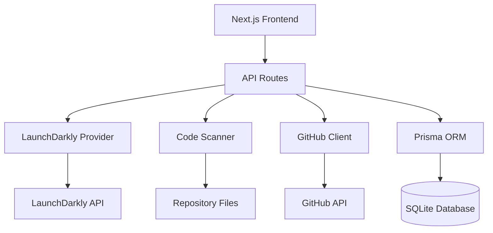

# Feature Flag Removal Dashboard

A production-ready web application that automates the safe removal of stale feature flags from your codebase. Integrates with LaunchDarkly to identify flags, scans repositories for references, and generates pull requests with flag removal code.

## Features

- 🚩 **Flag Management**: List and filter feature flags from LaunchDarkly with staleness indicators
- 🔍 **Code Scanning**: Multi-language pattern matching (TypeScript, Python, Java, Go)
- 🤖 **Automated Removal**: Generate PRs with flag removal code and confidence scoring
- 📊 **Session Tracking**: Monitor scan progress and results in real-time
- 📝 **Audit Logging**: Complete history of all flag removal operations
- 🔒 **Safety Rails**: Dry-run mode, confidence scoring, and rollback instructions

## Tech Stack

- **Frontend**: Next.js 14+ (App Router), TypeScript 5+, Tailwind CSS, shadcn/ui
- **Backend**: Next.js API Routes (Node 20+)
- **Database**: SQLite via Prisma ORM
- **Auth**: GitHub OAuth (next-auth v5)
- **Code Scanning**: Multi-language pattern matching
- **GitHub Integration**: Octokit REST API + simple-git
- **Testing**: Vitest (unit), Playwright (e2e)
- **Containerization**: Docker + docker-compose
- **CI/CD**: GitHub Actions

## Architecture



## Prerequisites

- Node.js 20+
- npm or yarn
- LaunchDarkly account with API token
- GitHub account with Personal Access Token or GitHub App
- Git installed locally

## Installation

### 1. Clone the Repository

```bash
git clone https://github.com/chrisdarcy-quantum/DevinAutomation.git
cd DevinAutomation
```

### 2. Install Dependencies

```bash
npm install
```

### 3. Configure Environment Variables

Copy the example environment file:

```bash
cp .env.example .env
```

Edit `.env` with your credentials:

| Variable | Description | Required |
|----------|-------------|----------|
| `DATABASE_URL` | SQLite database path | Yes |
| `GITHUB_TOKEN` | GitHub Personal Access Token | Yes* |
| `GITHUB_APP_ID` | GitHub App ID | Yes* |
| `GITHUB_APP_INSTALLATION_ID` | GitHub App Installation ID | Yes* |
| `GITHUB_APP_PRIVATE_KEY` | GitHub App Private Key | Yes* |
| `GITHUB_ORG` | GitHub organization name | Yes |
| `REPO_ALLOWLIST` | Comma-separated list of repos | Yes |
| `LD_API_TOKEN` | LaunchDarkly API token | Yes |
| `LD_PROJECT_KEY` | LaunchDarkly project key | Yes |
| `LD_ENV_KEY` | LaunchDarkly environment key | Yes |
| `NEXTAUTH_URL` | Application URL | Yes |
| `NEXTAUTH_SECRET` | NextAuth secret (generate with `openssl rand -base64 32`) | Yes |

*Either use `GITHUB_TOKEN` (PAT) OR GitHub App credentials (ID, Installation ID, Private Key)

### 4. Set Up Database

Generate Prisma client and run migrations:

```bash
npx prisma generate
npx prisma migrate dev --name init
```

### 5. Start Development Server

```bash
npm run dev
```

Visit [http://localhost:3000](http://localhost:3000)

## Usage

### 1. View Feature Flags

The home page displays all feature flags from LaunchDarkly with:
- Flag key and name
- Status (Active/Stale/Archived)
- Last evaluation date
- Tags

### 2. Scan for Flag References

1. Click "Scan & Remove" on any flag
2. Select repositories to scan
3. Click "Start Scan"
4. Monitor progress on the scan results page

### 3. Create Pull Request

Once scanning is complete:
1. Review scan results and confidence scores
2. Click "Create Pull Request"
3. PRs are created with:
   - Detailed change summary
   - Confidence breakdown
   - Rollback instructions
   - Test results

### 4. View History

- **Sessions**: View all scan sessions and their status
- **Audit Log**: Complete history of all operations

## API Endpoints

| Endpoint | Method | Description |
|----------|--------|-------------|
| `/api/flags` | GET | List feature flags from LaunchDarkly |
| `/api/scan` | POST | Start a new scan session |
| `/api/sessions/:id` | GET | Get session details and results |
| `/api/pr/create` | POST | Create PRs from scan results |
| `/api/audit` | GET | Fetch audit logs |

## Testing

### Run Unit Tests

```bash
npm run test
```

### Run Tests in Watch Mode

```bash
npm run test:watch
```

### Run Tests with UI

```bash
npm run test:ui
```

## Docker Deployment

### Build and Run with Docker Compose

```bash
docker-compose up -d
```

### Build Docker Image Manually

```bash
docker build -t flag-removal-dashboard .
docker run -p 3000:3000 --env-file .env flag-removal-dashboard
```

## CI/CD

GitHub Actions workflow runs on every push and pull request:

1. **Lint**: ESLint checks
2. **Test**: Unit tests with Vitest
3. **Build**: Next.js production build
4. **Docker**: Build Docker image

**Note**: The CI workflow file (`.github/workflows/ci.yml`) needs to be added manually with a GitHub token that has `workflow` scope.

## Configuration

### Supported Languages

The scanner supports pattern matching for:

- **TypeScript/JavaScript**: `.ts`, `.tsx`, `.js`, `.jsx`
- **Python**: `.py`
- **Java**: `.java`
- **Go**: `.go`

### Safety Features

- **Dry-run by default**: No automatic flag archival
- **Confidence scoring**: High/Medium/Low based on SDK import proximity
- **Audit logging**: All operations logged to database
- **Rollback instructions**: Included in every PR
- **CODEOWNERS requirement**: Ensures proper review process

### Customization

Edit these files to customize behavior:

- `lib/scanner/patterns.ts`: Add new language patterns
- `lib/providers/`: Add new feature flag providers
- `app/api/pr/create/route.ts`: Customize PR template

## Troubleshooting

### Database Issues

If you encounter database errors:

```bash
rm prisma/dev.db
npx prisma migrate reset
npx prisma generate
```

### LaunchDarkly API Errors

Verify your API token has the correct permissions:
- Read access to flags
- Write access for archival (if enabled)

### GitHub API Rate Limits

If using a Personal Access Token, you may hit rate limits. Consider using a GitHub App for higher limits.

### Scan Timeout

Increase the timeout in `.env`:

```bash
SCAN_TIMEOUT_MS=600000  # 10 minutes
```

## Development

### Project Structure

```
DevinAutomation/
├── app/                    # Next.js app directory
│   ├── api/               # API routes
│   ├── scan/              # Scan results page
│   ├── sessions/          # Session history page
│   ├── audit/             # Audit log page
│   └── page.tsx           # Home page (flag list)
├── components/            # React components
│   └── ui/                # shadcn/ui components
├── lib/                   # Core libraries
│   ├── providers/         # Feature flag providers
│   ├── scanner/           # Code scanning engine
│   └── github/            # GitHub integration
├── prisma/                # Database schema and migrations
├── __tests__/             # Unit tests
├── .github/workflows/     # CI/CD workflows
├── Dockerfile             # Docker configuration
└── docker-compose.yml     # Docker Compose configuration
```

### Adding a New Provider

1. Create `lib/providers/your-provider.ts`
2. Implement the `FeatureFlagProvider` interface
3. Export the provider instance
4. Update API routes to support the new provider

### Adding Language Support

1. Add patterns to `lib/scanner/patterns.ts`
2. Define file extensions, SDK imports, and flag call patterns
3. Test with sample code files

## Contributing

1. Fork the repository
2. Create a feature branch: `git checkout -b feature/your-feature`
3. Commit changes: `git commit -am 'Add your feature'`
4. Push to branch: `git push origin feature/your-feature`
5. Create a Pull Request

## License

MIT License - see LICENSE file for details

## Support

For issues and questions:
- GitHub Issues: [https://github.com/chrisdarcy-quantum/DevinAutomation/issues](https://github.com/chrisdarcy-quantum/DevinAutomation/issues)
- Email: Chris.darcy5@gmail.com

## Acknowledgments

Built with:
- [Next.js](https://nextjs.org/)
- [Prisma](https://www.prisma.io/)
- [shadcn/ui](https://ui.shadcn.com/)
- [LaunchDarkly](https://launchdarkly.com/)
- [Octokit](https://github.com/octokit)

---

**Note**: This is a production-ready MVP. For enterprise deployment, consider adding:
- Redis for job queue management
- PostgreSQL for production database
- Kubernetes deployment manifests
- Advanced monitoring and alerting
- Multi-tenancy support
